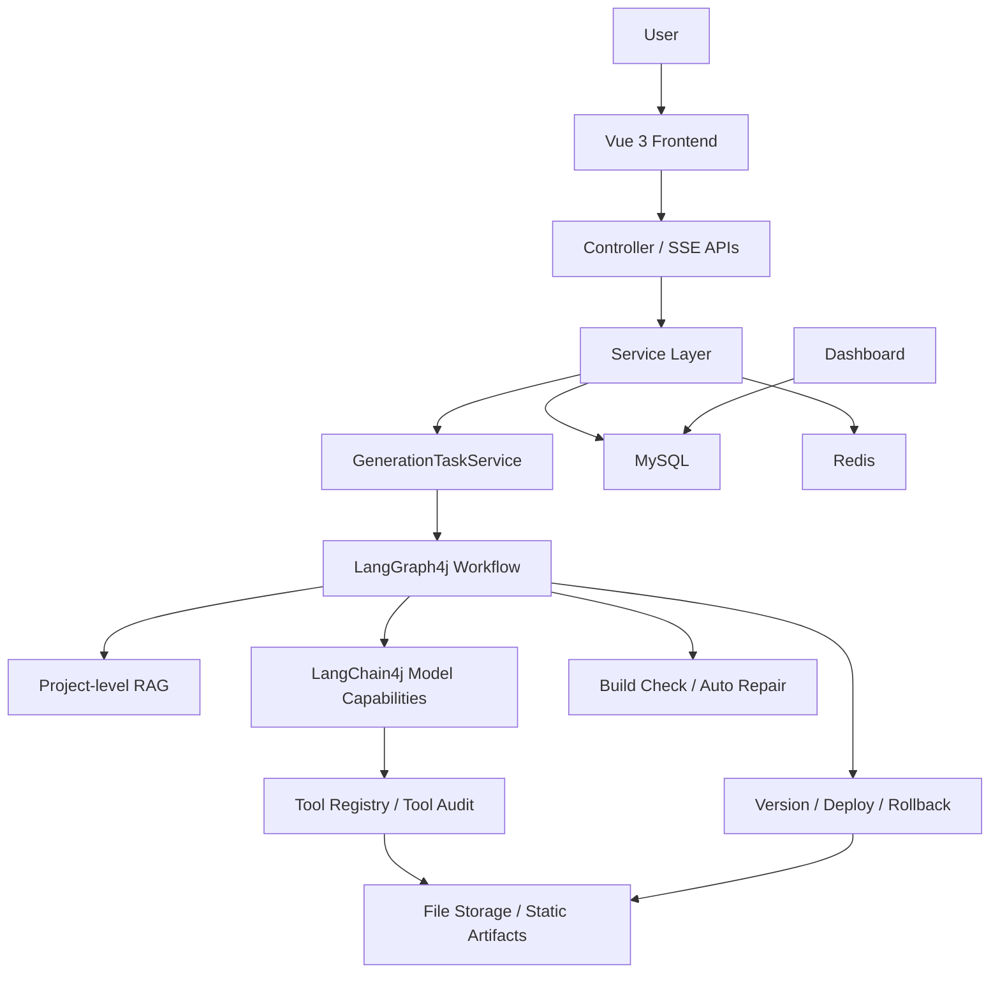
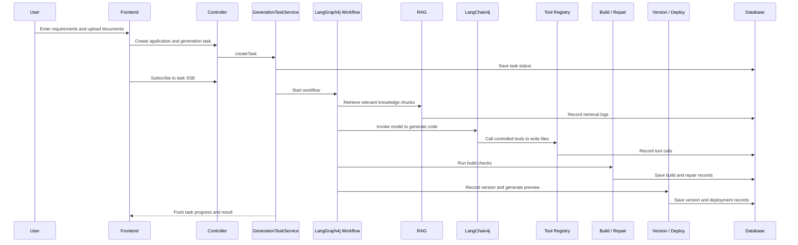
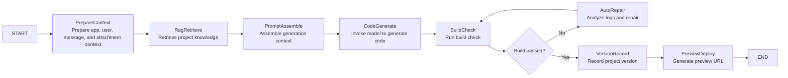

<div align="center">
  <h1>
    Zero Logic
  </h1>

  <p>
    <a href="https://openjdk.org/projects/jdk/21/"></a>
    <a href="https://spring.io/projects/spring-boot"></a>
    <a href="https://vuejs.org/"></a>
    <a href="https://www.typescriptlang.org/"></a>
    <a href="https://github.com/langchain4j/langchain4j"></a>
    <a href="https://github.com/langgraph4j/langgraph4j"></a>
    <a href="LICENSE"></a>
  </p>
</div>

[简体中文](README.zh-CN.md)

Zero Logic is an Agentic Coding platform for frontend application generation, built with Spring Boot 3, Vue 3, LangChain4j, and LangGraph4j.

The project focuses on the full engineering workflow of AI code generation: from requirement input, document understanding, RAG retrieval, and workflow orchestration to code generation, build checks, auto repair, versioned deployment, and process observability. Its goal is to make generated applications runnable, and to make the generation process traceable, verifiable, and governable.

## Overview

```text
Requirement input
  -> Document parsing / RAG retrieval
  -> LangGraph4j workflow orchestration
  -> LangChain4j model invocation and tool calling
  -> Code generation
  -> Build check / auto repair
  -> Versioning / preview deployment / rollback
  -> Tool audit / token usage / dashboard metrics
```

## Features

**Application Generation and Iteration**

- Generate HTML, multi-file web pages, and Vue projects from natural language prompts. Generated code is saved as a project structure that can be previewed and built.
- Continue modifying an existing application through multi-turn conversations, using historical context, the current version, and new user requirements.
- Stream model output and task progress through SSE, so long-running generation is not a black box.

**Document Understanding and Project-level RAG**

- Upload txt, markdown, and PDF documents, then parse them as data sources for an application-private knowledge base.
- Chunk documents, generate embeddings, and perform TopK retrieval before generation, instead of simply appending full documents to the prompt.
- Record RAG retrieval logs and cited sources, making it clear which materials were referenced during generation.

**Task-based Workflow**

- Create a task for each generation, tracking status, current step, error message, token usage, and tool call count.
- Use LangGraph4j to orchestrate context preparation, RAG retrieval, code generation, build checks, auto repair, and version recording.
- Use LangChain4j for model invocation, streaming output, prompt assembly, and tool calling, keeping model capabilities separate from workflow orchestration.

**Quality Loop and Tool Governance**

- Run build checks after code generation. When a build fails, record the error log and trigger a limited auto-repair process.
- Manage model-callable tools through an internal Tool Registry, recording tool name, risk level, call status, and error details.
- Keep audit records for high-risk operations such as file writes, builds, deployments, and rollbacks, laying the groundwork for sandboxing and policy control.

**Versioned Deployment and Observability**

- Create a project version after each successful generation, with support for preview deployment, deployment records, and rollback.
- Provide dashboard metrics for generation task count, success rate, average duration, token usage, tool calls, build results, and repair results.

## Architecture

Overall architecture:



Simplified flow:

```text
Vue 3 frontend
  -> Spring Boot controllers
  -> Service layer
  -> GenerationTaskService
  -> LangGraph4j Workflow
      -> RAG retrieval
      -> LangChain4j model generation
      -> Tool Registry
      -> Build check
      -> Auto repair
      -> Version and deployment
  -> MySQL / Redis / file storage / static artifacts
```

LangChain4j and LangGraph4j have different responsibilities:

- LangChain4j handles model capabilities, including prompt assembly, model invocation, streaming output, and tool calling.
- LangGraph4j handles workflow orchestration, including context preparation, RAG retrieval, code generation, build checks, auto repair, and task state transitions.

Business data and permission control remain in the Spring Service layer. Workflow nodes call existing business services instead of replacing them.

## Main Flow

A complete application generation flow:



The key point is that generation is not a black box. Requirements, retrieval, model invocation, tool execution, build results, repair records, and deployed versions can all be traced.

## Workflows

### Application Generation Workflow

The application generation workflow turns user requirements into a previewable and rollbackable application version.



The first version of the workflow does not aim for complex multi-agent collaboration. It focuses on giving the main generation path clear steps and states, creating a stable foundation for RAG, auto repair, and evaluation.

### Document Ingestion and RAG Retrieval Workflow

The document workflow turns uploaded files into retrievable knowledge and injects relevant context before generation.

```mermaid
flowchart LR
    Upload["Upload Document"]
    Validate["Validate File"]
    Parse["Parse Text"]
    Chunk["Chunk Document"]
    Embed["Generate Embedding"]
    Save["Save Knowledge"]
    Query["Retrieve TopK Before Generation"]
    Inject["Inject into Model Context"]
    Log["Record Retrieval Log"]
    Cite["Show Cited Sources"]

    Upload --> Validate --> Parse --> Chunk --> Embed --> Save
    Save --> Query --> Inject --> Log --> Cite
```



This workflow avoids directly appending full documents to the prompt. The system parses, chunks, embeds, and retrieves documents first, then injects the matched chunks into the generation context.

## Tech Stack

Backend:

- Java 21
- Spring Boot 3
- MyBatis-Flex
- MySQL 8
- Redis / Redisson / Spring Session
- LangChain4j
- LangGraph4j
- DashScope OpenAI-compatible API
- PDFBox
- Caffeine
- Selenium / WebDriverManager
- Spring Boot Actuator / Micrometer / Prometheus

Frontend:

- Vue 3
- TypeScript
- Vite
- Ant Design Vue
- Pinia
- Vue Router
- Axios

## Getting Started

### Prerequisites

Prepare the following services and local configuration before starting the project:

- JDK 21
- Maven
- Node.js and npm
- MySQL 8
- Redis
- Model API key
- Local file storage path

Do not commit real credentials. Use a local profile such as `application-local.yml` or environment variables for sensitive configuration.

### Backend

Start the backend:

```bash
./mvnw spring-boot:run
```

Compile check:

```bash
./mvnw -DskipTests compile
```

### Frontend

```bash
cd zero-logic-frontend
npm install
npm run dev
```

Type check:

```bash
npm run type-check
```

Build:

```bash
npm run build-only
```

## License

This project is licensed under the [Apache License 2.0](LICENSE).
