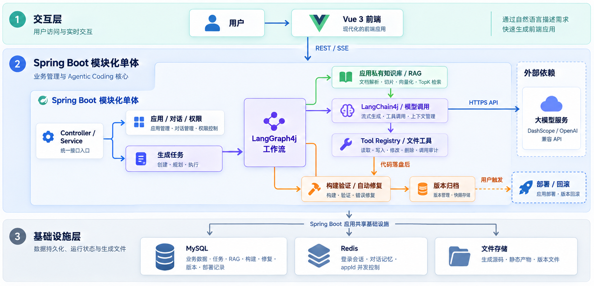

<div align="center">
  <h1>
    Zero Logic
  </h1>

  <p>
    <strong>从自然语言需求到可构建、可部署的前端项目</strong>
  </p>

  <p>
    <a href="https://openjdk.org/projects/jdk/21/"></a>
    <a href="https://spring.io/projects/spring-boot"></a>
    <a href="https://vuejs.org/"></a>
    <a href="https://github.com/langchain4j/langchain4j"></a>
    <a href="LICENSE"></a>
  </p>
</div>

Zero Logic 是一个面向前端应用生成的 Agentic Coding 平台，基于 Spring Boot 3、Vue 3、LangChain4j 和 LangGraph4j 构建。

用户可以通过自然语言和需求文档生成 HTML 单页、多文件网页和 Vue 项目，也可以围绕已有应用持续对话修改，并管理生成版本。

系统将每次代码生成作为持久化任务运行：生成前通过 RAG 补充需求上下文，代码落盘后执行真实构建，并对符合条件的 Vue 构建错误进行有限次数的自动修复；构建成功后归档源码和静态产物，支持指定版本部署与历史版本回滚。Agent 文件操作通过 Tool Registry 受控执行并保留调用记录。


## 核心亮点

### 需求文档 RAG 与上下文管理

系统将 TXT、Markdown 和 PDF 需求文档解析、切片并向量化，按应用构建私有知识库。生成或修改代码时，根据当前需求检索 TopK 相关片段，
并与对话需求和视觉素材共同组装长度受控的模型上下文；同时记录命中来源、相似度和注入长度，检索异常时降级为无知识库生成，避免 RAG 故障阻断
代码生成。

### 代码构建、自动修复与版本管理

代码生成完成并落盘后，系统自动执行项目构建并记录构建结果、错误日志和产物信息。对于满足修复条件的 Vue 构建错误，系统分析错误信息并触发有限
次数的自动修复和重新构建；构建成功后归档源码与静态产物，支持指定版本部署和历史版本回滚。

### Agent 文件工具管控与调用审计

Agent 的文件读取、写入、修改和删除统一通过 Tool Registry 执行，并通过工作目录限制、路径规范化、符号链接检查和关键文件保护控制文件操作
范围。系统记录工具风险等级、调用来源、脱敏参数、执行状态、耗时和异常，为生成任务的问题定位和调用审计提供依据。

## 系统架构



详细模块职责、生成链路和工作流说明见 [项目设计文档](docs/project-overview.md)。

## 技术栈

后端：

- Java 21
- Spring Boot 3
- MyBatis-Flex
- MySQL 8
- Redis / Redisson / Spring Session
- LangChain4j
- LangGraph4j
- DashScope OpenAI 兼容 API
- PDFBox
- Caffeine
- Selenium / WebDriverManager
- Spring Boot Actuator / Micrometer / Prometheus

前端：

- Vue 3
- TypeScript
- Vite
- Ant Design Vue
- Pinia
- Vue Router
- Axios

## 本地启动

### 前置条件

启动项目前，请先准备以下服务和本地配置：

- JDK 21
- Maven
- Node.js 和 npm
- MySQL 8
- Redis
- 模型 API Key
- 本地文件存储路径

不要提交真实密钥。敏感配置请使用 `application-local.yml` 这类本地 profile，或通过环境变量注入。

### 后端

启动后端：

```bash
./mvnw spring-boot:run
```

编译检查：

```bash
./mvnw -DskipTests compile
```

### 前端

```bash
cd zero-logic-frontend
npm install
npm run dev
```

类型检查：

```bash
npm run type-check
```

构建：

```bash
npm run build-only
```

## 相关文档

- [项目架构与核心流程](docs/project-overview.md)

## License

本项目基于 [Apache License 2.0](LICENSE) 开源。
