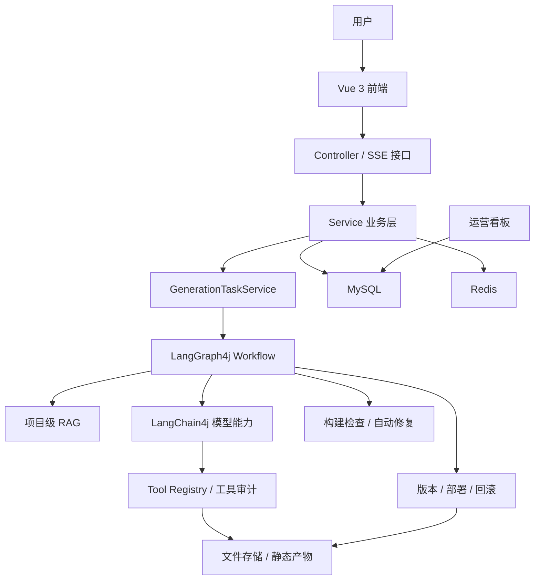
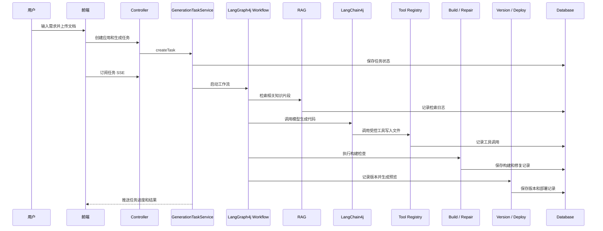
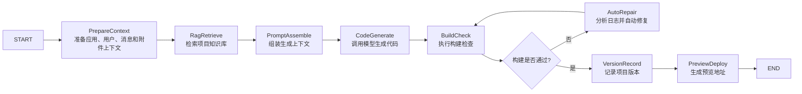

<div align="center">
  <h1>
    Zero Logic
  </h1>

  <p>
    <a href="https://openjdk.org/projects/jdk/21/">
      
    </a>
    <a href="https://spring.io/projects/spring-boot">
      
    </a>
    <a href="https://vuejs.org/">
      
    </a>
    <a href="https://www.typescriptlang.org/">
      
    </a>
    <a href="https://github.com/langchain4j/langchain4j">
      
    </a>
    <a href="https://github.com/langgraph4j/langgraph4j">
      
    </a>
    <a href="LICENSE">
      
    </a>
  </p>
</div>

[English](README.md)

Zero Logic 是一个面向前端应用生成场景的 Agentic Coding 平台，基于 Spring Boot 3、Vue 3、LangChain4j 和 LangGraph4j 构建。

项目围绕 AI 代码生成的完整工程链路展开：从需求输入、文档理解、RAG 检索、工作流编排，到代码生成、构建检查、自动修复、版本部署和过程观测，目标是让生成结果可运行，让生成过程可追踪、可验证、可治理。

## 项目概览

```text
需求输入
  -> 文档解析 / RAG 检索
  -> LangGraph4j 工作流编排
  -> LangChain4j 模型调用与工具调用
  -> 代码生成
  -> 构建检查 / 自动修复
  -> 版本管理 / 预览部署 / 回滚
  -> 工具审计 / Token 用量 / 看板指标
```

## 核心能力

**应用生成与多轮迭代**

- 支持根据自然语言生成 HTML、多文件网页和 Vue 项目，生成结果会落盘为可预览、可构建的项目结构。
- 支持基于已有应用继续对话修改，结合历史上下文、当前版本和用户新需求进行迭代生成。
- 通过 SSE 推送模型输出和任务进度，避免长时间生成过程变成黑盒。

**文档理解与项目级 RAG**

- 支持上传 txt、markdown、PDF 文档，解析后作为应用私有知识库的数据来源。
- 对文档进行切片、向量化和 TopK 检索，生成时注入命中的知识片段，而不是简单拼接全文。
- 记录 RAG 检索日志和引用来源，便于追踪本次生成参考了哪些资料。

**任务化工作流**

- 每次生成都会创建任务，记录状态、当前步骤、错误信息、Token 用量和工具调用次数。
- 使用 LangGraph4j 编排上下文准备、RAG 检索、代码生成、构建检查、自动修复和版本记录等步骤。
- 使用 LangChain4j 承载模型调用、流式输出、Prompt 组装和工具调用，两者职责清晰。

**质量闭环与工具治理**

- 生成代码后执行构建检查，失败时记录错误日志并触发有限次数的自动修复。
- 通过 Tool Registry 管理模型可调用工具，并记录工具名称、风险等级、调用状态和错误信息。
- 文件写入、构建、部署、回滚等高风险操作保留审计记录，为后续沙箱隔离和策略控制打基础。

**版本部署与可观测性**

- 每次成功生成形成项目版本，支持预览部署、部署记录和版本回滚。
- 看板统计生成任务数、成功率、平均耗时、Token 消耗、工具调用、构建结果和修复结果。

## 架构

整体架构如下：



简化链路：

```text
Vue 3 前端
  -> Spring Boot Controller
  -> Service 业务层
  -> GenerationTaskService
  -> LangGraph4j Workflow
      -> RAG 检索
      -> LangChain4j 模型生成
      -> Tool Registry
      -> 构建检查
      -> 自动修复
      -> 版本与部署
  -> MySQL / Redis / 文件存储 / 静态产物
```

LangChain4j 和 LangGraph4j 的职责不同：

- LangChain4j 负责模型能力，包括 Prompt 组装、模型调用、流式输出和工具调用。
- LangGraph4j 负责工作流编排，包括上下文准备、RAG 检索、代码生成、构建检查、自动修复和任务状态流转。

业务数据和权限控制仍由 Spring Service 层负责。工作流节点调用已有业务服务，而不是替代业务服务。

## 主要链路

一次完整的应用生成链路如下：



这条链路的重点是：生成过程不是黑盒。需求、检索、模型调用、工具执行、构建结果、修复记录和部署版本都可以被追踪。

## 工作流

### 应用生成工作流

应用生成工作流负责把用户需求转化为可预览、可回滚的应用版本。



第一版工作流不追求复杂多 Agent 协作，而是先让主生成链路具备明确步骤和状态，为后续扩展 RAG、自动修复和评测提供稳定基础。

### 文档入库与 RAG 检索工作流

文档工作流负责把上传文件转化为可检索知识，并在生成前注入相关上下文。


这条工作流的目标是避免把整篇文档直接塞进 prompt。系统会先解析、切片、向量化和检索，再把命中的片段作为上下文参与生成。

## 技术栈

后端：

- Java 21
- Spring Boot 3
- MyBatis-Flex
- MySQL 8
- Redis / Redisson / Spring Session
- LangChain4j
- LangGraph4j
- DashScope OpenAI 兼容 API
- PDFBox
- Caffeine
- Selenium / WebDriverManager
- Spring Boot Actuator / Micrometer / Prometheus

前端：

- Vue 3
- TypeScript
- Vite
- Ant Design Vue
- Pinia
- Vue Router
- Axios

## 本地启动

### 前置条件

启动项目前，请先准备以下服务和本地配置：

- JDK 21
- Maven
- Node.js 和 npm
- MySQL 8
- Redis
- 模型 API Key
- 本地文件存储路径

不要提交真实密钥。敏感配置请使用 `application-local.yml` 这类本地 profile，或通过环境变量注入。

### 后端

启动后端：

```bash
./mvnw spring-boot:run
```

编译检查：

```bash
./mvnw -DskipTests compile
```

### 前端

```bash
cd zero-logic-frontend
npm install
npm run dev
```

类型检查：

```bash
npm run type-check
```

构建：

```bash
npm run build-only
```

## License

本项目基于 [Apache License 2.0](LICENSE) 开源。
